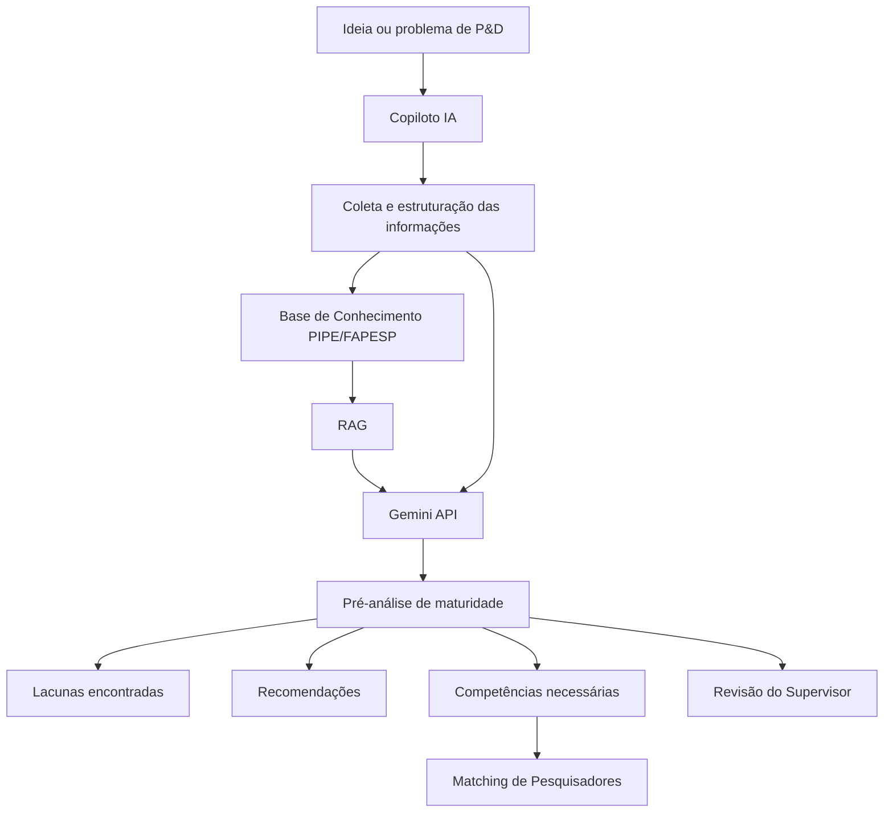
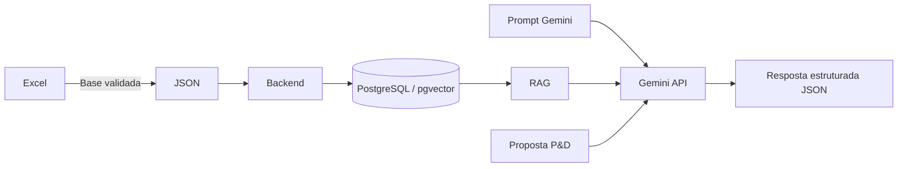
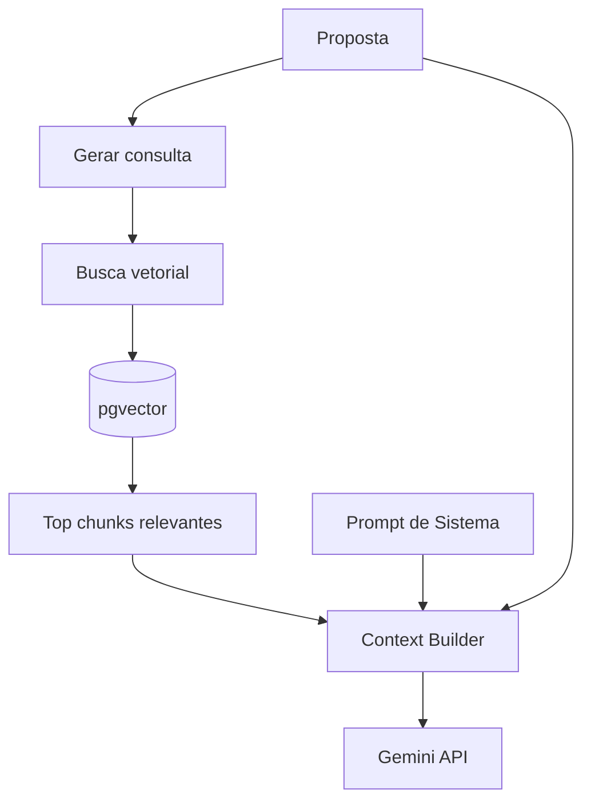

# 🤖 Inteligência Artificial — P&D Connect

> Módulo responsável pela estruturação inteligente de propostas de P&D, pré-análise de maturidade, consulta à base de conhecimento PIPE/FAPESP e apoio ao matching de competências.

---

## 📌 Visão geral

O módulo de Inteligência Artificial do **P&D Connect** utiliza um modelo de linguagem de grande escala — inicialmente a **API do Gemini** — combinado com uma arquitetura **RAG (Retrieval-Augmented Generation)**.

A IA não é treinada diretamente com os documentos da FAPESP.

Em vez disso, o sistema mantém uma **Base de Conhecimento estruturada e versionada**, contendo critérios, regras, requisitos, documentos, perguntas, fontes e exemplos públicos relacionados ao programa PIPE.

Durante uma análise, apenas as informações relevantes são recuperadas e fornecidas ao Gemini junto com a proposta que está sendo avaliada.



---

# 📂 Arquivos da Base de Conhecimento

Atualmente o módulo utiliza três arquivos principais:

```text
IA/
│
├── README.md
│
├── Colinha_IA_PIPE_Jornada_Fase1_PD_Connect_v2.xlsx
├── Colinha_IA_PIPE_Jornada_Fase1_PD_Connect_v2.json
└── Prompt_Gemini_PIPE_Jornada_Fase1_v2.txt
```

Cada arquivo possui uma responsabilidade diferente.

---

## 📊 1. Base de Conhecimento — Excel

### `Colinha_IA_PIPE_Jornada_Fase1_PD_Connect_v2.xlsx`

O Excel é a **versão humana da Base de Conhecimento**.

Ele foi criado para permitir que desenvolvedores, Product Owner, Supervisor e demais envolvidos consigam consultar, revisar e atualizar as regras utilizadas pela IA.

> ⚠️ O arquivo Excel **não deve ser enviado diretamente ao Gemini durante uma avaliação**.

Ele funciona principalmente como documentação e governança da inteligência do sistema.

### Conteúdo

A base atualmente possui informações como:

- fontes oficiais utilizadas;
- hierarquia das fontes;
- requisitos mínimos;
- gates de enquadramento;
- estrutura da pré-proposta;
- critérios de avaliação;
- regras de elegibilidade;
- regras de orçamento;
- regras de bolsas;
- documentos necessários;
- propriedade intelectual;
- participação de terceiros;
- estrutura de projeto completo;
- Súmula Curricular;
- campos do SAGe;
- perguntas do Copiloto;
- chunks utilizados pelo RAG;
- projetos PIPE públicos para referência contextual;
- estrutura sugerida do banco de dados;
- versionamento da base.

### Uso no projeto

```text
Documentação oficial
        ↓
Análise e estruturação
        ↓
Base Excel
        ↓
Revisão humana
        ↓
Base JSON / Banco de Dados
```

O Excel deve ser considerado a **fonte de governança da Base de Conhecimento**.

---

# ⚙️ 2. Base de Conhecimento — JSON

### `Colinha_IA_PIPE_Jornada_Fase1_PD_Connect_v2.json`

O JSON é a **versão estruturada para utilização pelo software**.

Ele contém as regras presentes na documentação em um formato que pode ser facilmente interpretado pelo backend.

Exemplo simplificado:

```json
{
  "id": "A3",
  "component": "Projeto",
  "label": "Metodologia adequada",
  "evaluation_question": "A metodologia é adequada para atingir os objetivos e resolver as incertezas?",
  "official_weight": null,
  "source_id": "SRC-01",
  "section": "8.5"
}
```

Enquanto o Excel foi desenvolvido para leitura humana:

```text
Excel
↓
Pessoa consegue entender e revisar
```

O JSON foi desenvolvido para:

```text
JSON
↓
Backend
↓
Banco de Dados
↓
RAG
↓
Gemini
```

### Utilização esperada

Inicialmente, o backend pode carregar diretamente o JSON.

Em uma arquitetura mais madura, as informações deverão ser importadas para o banco:

```text
JSON

 ↓

PostgreSQL

 ├── kb_sources
 ├── kb_rules
 ├── kb_criteria
 ├── kb_chunks
 ├── supported_projects
 └── versions
```

Os chunks poderão posteriormente possuir **embeddings vetoriais** armazenados utilizando `pgvector`.

---

# 🧠 3. Prompt de Sistema

### `Prompt_Gemini_PIPE_Jornada_Fase1_v2.txt`

O Prompt de Sistema define **como o Gemini deve se comportar** durante a execução da pipeline.

Ele não contém toda a documentação da FAPESP.

Sua função é determinar regras de comportamento e interpretação.

Entre as principais instruções estão:

```text
Não representar a FAPESP.

Não afirmar que uma proposta será aprovada.

Não calcular probabilidade de aprovação.

Não inventar critérios.

Não inventar documentos ou regras.

Utilizar somente as fontes disponibilizadas.

Informar quando houver dados insuficientes.

Diferenciar regras oficiais de exemplos públicos.

Respeitar a hierarquia das fontes.

Utilizar a escala de maturidade somente como indicador interno do P&D Connect.
```

O arquivo deve ser utilizado como **System Prompt** nas chamadas realizadas à API do Gemini.

Exemplo conceitual:

```text
SYSTEM
   ↓
Prompt_Gemini_PIPE_Jornada_Fase1_v2.txt

CONTEXT
   ↓
Regras recuperadas pelo RAG

USER DATA
   ↓
Proposta que está sendo analisada

        ↓

     GEMINI
```

---

# 🔄 Como os três arquivos trabalham juntos

Os arquivos possuem responsabilidades diferentes e não devem ser confundidos.

| Arquivo | Responsabilidade | Usuário principal |
|---|---|---|
| `.xlsx` | Documentação e manutenção da Base de Conhecimento | Equipe / Supervisor |
| `.json` | Estrutura utilizada pelo software | Backend |
| `.txt` | Regras de comportamento do Gemini | Pipeline de IA |

O fluxo completo é:



---

# 🧩 Pipeline de IA

A IA do P&D Connect é dividida conceitualmente em quatro etapas.

```text
1. STRUCTURE
   ↓
Estrutura a ideia ou problema de P&D

2. GATE_CHECK
   ↓
Verifica requisitos mínimos e incompatibilidades

3. MATURITY_ASSESS
   ↓
Realiza a pré-análise da maturidade da proposta

4. MATCHING_SUPPORT
   ↓
Identifica competências necessárias para o projeto
```

---

## 1️⃣ Estruturação da proposta

O usuário pode iniciar com uma ideia simples, por exemplo:

```text
"Queremos desenvolver um método mais rápido
para detectar determinado microrganismo."
```

O Copiloto consulta o banco de perguntas e começa a solicitar informações.

Exemplo:

```text
Qual problema está sendo resolvido?

Quem sofre com esse problema?

Qual é a limitação dos métodos atuais?

Qual é o diferencial da proposta?

O que ainda não está tecnicamente comprovado?

Como a hipótese será testada?

Quem executará os experimentos?

Qual infraestrutura está disponível?
```

Ao final, a ideia passa a possuir uma estrutura semelhante a:

```json
{
  "problema": "...",
  "desafio_tecnologico": "...",
  "incerteza_tecnica": "...",
  "objetivos": "...",
  "metodologia": "...",
  "entregavel": "...",
  "mercado": "...",
  "equipe": "...",
  "infraestrutura": "...",
  "orcamento": "..."
}
```

---

# 🚧 Gates

Antes de avaliar a maturidade da proposta, o sistema executa os **Gates de Enquadramento**.

Os gates verificam problemas como:

```text
Existe realmente um desafio tecnológico?

Existe atividade de P&D?

A equipe possui as competências necessárias?

Existe infraestrutura adequada?

O orçamento é compatível?

O pesquisador atende aos requisitos?

A empresa atende aos requisitos?

Existe risco relacionado à propriedade intelectual?
```

Os possíveis resultados internos são:

```text
PASS
   requisito suficientemente demonstrado

REVIEW
   necessita complementação ou revisão humana

FAIL
   incompatibilidade identificada com uma regra ativa
```

> `FAIL` é apenas um resultado interno do P&D Connect e **não representa uma decisão da FAPESP**.

---

# 📈 Avaliação de maturidade

Depois dos Gates, a IA pode realizar a pré-análise utilizando os critérios cadastrados na Base de Conhecimento.

Exemplo:

```text
A1 — Objetivos

A2 — Plano e cronograma

A3 — Metodologia

A4 — Estado da arte

A5 — Prazo

A6 — Propriedade intelectual
```

Além de critérios relacionados a:

```text
Equipe

Mercado

Bolsas

Orçamento

Empresa
```

Cada critério utiliza uma escala interna:

| Nível | Significado |
|---|---|
| 0 | Não demonstrado |
| 1 | Inicial |
| 2 | Parcial |
| 3 | Adequado |
| 4 | Bem estruturado |

> ⚠️ Essa escala pertence exclusivamente ao **P&D Connect**.

Ela **não corresponde a uma nota oficial da FAPESP**.

---

# 📤 Resposta esperada da IA

O Gemini deve devolver resultados estruturados.

Exemplo:

```json
{
  "criterion_id": "A3",
  "maturity_internal": 2,
  "confidence": "alta",

  "evidences": [
    "A proposta descreve um método experimental."
  ],

  "gaps": [
    "Não foi definido o tamanho amostral.",
    "Não foi definido um critério objetivo de validação."
  ],

  "recommendations": [
    "Definir quantidade e perfil das amostras.",
    "Definir método de referência.",
    "Estabelecer critérios mensuráveis de sucesso."
  ],

  "source_refs": [
    {
      "source_id": "SRC-01",
      "section": "8.5"
    }
  ]
}
```

Dessa forma, o frontend consegue apresentar separadamente:

```text
Maturidade

Evidências encontradas

Lacunas

Riscos

Recomendações

Fontes utilizadas
```

---

# 🔎 RAG — Retrieval-Augmented Generation

O Gemini **não deve receber toda a Base de Conhecimento em todas as requisições**.

O RAG deverá selecionar somente as informações relevantes para determinada análise.

Exemplo:

```text
Proposta fala sobre:

→ metodologia
→ microbiologia
→ bolsas TT
→ equipamento
→ serviço de terceiro
```

O Retriever poderá recuperar apenas chunks relacionados a:

```text
Metodologia

Equipe

Bolsa TT

Material Permanente

Serviço de Terceiros
```

Essas informações são então adicionadas ao contexto enviado ao Gemini.



---

# 📚 Hierarquia das fontes

Nem todas as informações possuem a mesma autoridade.

O sistema deve respeitar a seguinte ordem:

```text
1. Chamada específica
        ↓
2. FAQ oficial da chamada
        ↓
3. Normas PIPE compatíveis com a baseline
        ↓
4. Documentos oficiais complementares
        ↓
5. Manual SAGe
        ↓
6. Modelos complementares
        ↓
7. Projetos apoiados da Biblioteca Virtual
```

Em caso de conflito:

> A fonte de maior prioridade deve prevalecer.

O conflito deve permanecer registrado para rastreabilidade.

---

# 🧪 Projetos PIPE apoiados

Projetos públicos disponíveis na Biblioteca Virtual da FAPESP podem ser armazenados no RAG.

Sua finalidade é somente fornecer **contexto**.

Eles podem ajudar a IA a identificar:

```text
áreas de pesquisa semelhantes;

tecnologias relacionadas;

terminologia utilizada;

problemas tecnológicos próximos;

competências normalmente envolvidas.
```

Entretanto:

```text
PROJETO APOIADO ≠ REGRA

PROJETO APOIADO ≠ CRITÉRIO

PROJETO APOIADO ≠ GARANTIA DE APROVAÇÃO
```

A IA nunca deverá concluir:

```text
"Este projeto será aprovado porque existe
um projeto semelhante apoiado pela FAPESP."
```

---

# 👨‍🔬 Matching de Pesquisadores

Durante a análise da proposta, a IA também deverá extrair as competências necessárias.

Exemplo:

```json
{
  "competencies_required": [
    {
      "competency": "Microbiologia",
      "criticality": "critica"
    },
    {
      "competency": "Biologia Molecular",
      "criticality": "critica"
    },
    {
      "competency": "Análise Estatística",
      "criticality": "complementar"
    }
  ]
}
```

Essas competências serão comparadas com os pesquisadores cadastrados no P&D Connect.

```text
Proposta
   ↓
IA identifica competências
   ↓
Matching
   ↓
Base de Pesquisadores
   ↓
Equipe potencial
```

---

# 👤 Revisão do Supervisor

A IA funciona apenas como ferramenta de apoio.

Toda análise relevante poderá ser revisada pelo Supervisor.

```text
Avaliação IA
     ↓
Supervisor
     ↓
Concorda?
   ↙     ↘
 SIM     NÃO
          ↓
      Correção
```

As correções poderão futuramente formar uma base interna de feedback.

Exemplo:

```text
IA:
Metodologia = 2

Supervisor:
Metodologia = 3

Comentário:
"O método já possui validação preliminar,
mas isso não foi identificado pela IA."
```

Esses dados poderão ser armazenados para avaliar e melhorar o comportamento futuro do sistema.

---

# 🗃️ Estrutura futura

A Base de Conhecimento poderá deixar de depender diretamente do JSON e ser armazenada no PostgreSQL.

Arquitetura esperada:

```text
PostgreSQL
│
├── kb_sources
├── kb_rules
├── kb_criteria
├── kb_chunks
├── supported_projects
├── proposals
├── proposal_answers
├── ai_assessments
└── supervisor_reviews
```

Com `pgvector`:

```text
kb_chunks
│
├── content
├── metadata
└── embedding
```

---

# 🔖 Versionamento

A Base de Conhecimento deve ser versionada.

Nunca substituir silenciosamente regras antigas.

Exemplo:

```text
PIPE_JT_F1_2026_R1_V2

PIPE_JT_F1_2027_R1_V1

PIPE_JT_F1_2027_R2_V1
```

Toda avaliação deverá registrar a baseline utilizada:

```json
{
  "baseline_id": "PIPE_JT_F1_2026_R1_V2"
}
```

Dessa forma é possível saber exatamente **quais regras estavam sendo utilizadas quando uma avaliação foi realizada**.

---

# ⚠️ Limitações

O módulo de IA do P&D Connect:

**não representa a FAPESP;  
não emite parecer oficial;  
não aprova ou rejeita projetos;  
não calcula probabilidade de aprovação;  
não realiza submissões automaticamente;  
não substitui avaliação humana.**

Seu objetivo é:

> **estruturar propostas, identificar lacunas, organizar evidências e apoiar pesquisadores e Supervisores na preparação de projetos de P&D.**

---

## 📌 Baseline atual

```text
Programa:
PIPE Jornada Tecnológica

Fase:
Fase 1

Chamada:
1ª Rodada 2026

Baseline:
PIPE_JT_F1_2026_R1_V2
```

---

## 🚀 Fluxo resumido do módulo

```text
IDEIA
  ↓
COPILOTO
  ↓
PROPOSTA ESTRUTURADA
  ↓
GATES
  ↓
RAG
  ↓
GEMINI OU OUTRA IA
  ↓
PRÉ-ANÁLISE
  ↓
LACUNAS + RECOMENDAÇÕES
  ↓
COMPETÊNCIAS NECESSÁRIAS
  ↓
MATCHING
  ↓
REVISÃO DO SUPERVISOR
```

---

**P&D Connect — Inteligência Artificial aplicada à estruturação e gestão de projetos de Pesquisa e Desenvolvimento.**
